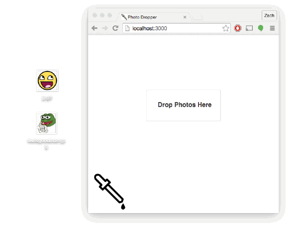

# Photo Dropper 💧
An app for uploading images and broadcasting them in realtime using RethinkDB, Express, socket.io, and Node.js

## Demo



## Setup

Make sure you have RethinkDB and Node.js installed. Then navigate to your photo-dropper directory and install all packages:

```
npm install
```
Start the server:

```
rethinkDB
```

After that, start the server:

```
node server/index.js
```

Go to `http://localhost:3000` in your browser to test the app out!
